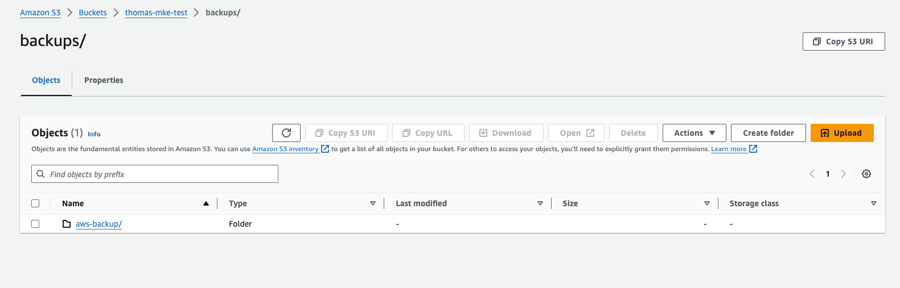

---
aliases:
  - /latest/configuration/backup-restore/external/
  - /docs/configuration/backup-restore/external/
title: Back up using an external storage provider
weight: 2
---

You can configure MKE 4k to externally store backups and restores, for example,
in object storage provided by a public cloud provider.


   AWS S3 is currently the only external backup storage supported by MKE 4k.


## Configure an external storage provider



AWS store backups in an object storage bucket. Mirantis recommends that each of
these buckets be unique for each Kubernetes cluster.



1. Create an S3 bucket:

   ```shell
   aws s3api create-bucket \
       --bucket <BUCKET_NAME> \
       --region <AWS_REGION> \
       --create-bucket-configuration LocationConstraint=<BUCKET_NAME>
   ```

   The `us-east-1` region does not support a `LocationConstraint` setting. As such, if your region is `us-east-1`, omit the bucket configuration.

   ```shell
   aws s3api create-bucket \
       --bucket <BUCKET_NAME> \
       --region us-east-1
   ```

2. Create an IAM user:

   ```shell
   aws iam create-user --user-name mke4backup
   ```

   

   To deploy multiple MKE 4k clusters, you can create a unique
   username per cluster instead of the default `mke4backup`. For more
   information, refer to the official AWS documentation, [What is IAM?](http://docs.aws.amazon.com/IAM/latest/UserGuide/introduction.html).

   

3. Attach a policy to affix the necessary permissions to the IAM user.

   

   <details>

   <summary>Click for example policy</summary>

      ```shell
      cat > mke4backup-policy.json <<EOF
      {
          "Version": "2012-10-17",
          "Statement": [
              {
                  "Effect": "Allow",
                  "Action": [
                      "ec2:DescribeVolumes",
                      "ec2:DescribeSnapshots",
                      "ec2:CreateTags",
                      "ec2:CreateVolume",
                      "ec2:CreateSnapshot",
                      "ec2:DeleteSnapshot"
                  ],
                  "Resource": "*"
              },
              {
                  "Effect": "Allow",
                  "Action": [
                      "s3:GetObject",
                      "s3:DeleteObject",
                      "s3:PutObject",
                      "s3:AbortMultipartUpload",
                      "s3:ListMultipartUploadParts"
                  ],
                  "Resource": [
                      "arn:aws:s3:::${BUCKET}/*"
                  ]
              },
              {
                  "Effect": "Allow",
                  "Action": [
                      "s3:ListBucket"
                  ],
                  "Resource": [
                      "arn:aws:s3:::${BUCKET}"
                  ]
              }
          ]
      }
      EOF
      ```

   </details>

   

   ```shell
   aws iam put-user-policy \
     --user-name mke4backup \
     --policy-name mke4backup \
     --policy-document file://mke4backup-policy.json
   ```

4. Create an access key for the IAM user:

   ```shell
   aws iam create-access-key --user-name mke4backup
   ```

   Example output:

   ```
   {
     "AccessKey": {
           "UserName": "mke4backup",
           "Status": "Active",
           "CreateDate": "2017-07-31T22:24:41.576Z",
           "SecretAccessKey": <AWS_SECRET_ACCESS_KEY>,
           "AccessKeyId": <AWS_ACCESS_KEY_ID>
      }
   }

5. Create an mke4backup-specific credentials file named `credentials-mke4backup`
   in your local directory, in which the access key ID and secret are the values returned from the `create-access-key` command:

   ```
   [mke4backup-profile]
   aws_access_key_id=<AWS_ACCESS_KEY_ID>
   aws_secret_access_key=<AWS_SECRET_ACCESS_KEY>
   ```

6. Edit the `storage_provider` section of the `mke4.yaml` configuration file,
   adding the AWS bucket name, bucket region, IAM credentials file path, and
   IAM credentials profile.

   Example:

   ```
   spec:
     backup:
       storage_provider:
         type: External
         external_options:
           provider: aws
           bucket: <BUCKET_NAME>
           region: <BUCKET_REGION>
           credentials_file_path: </PATH/TO/CREDENTIALS-MKE4BACKUP>
           credentials_file_profile: "mke4backup-profile"
   ```

7. Apply the configuration:

   ```shell
   mkectl apply
   ```

8. Verify the existence of the `BackupStorageLocation` custom resource:

   ```shell
   kubectl --kubeconfig <path-to-kubeconfig> get backupstoragelocation -n mke
   ```
   
   Example output:

   ```shell
   NAME      PHASE       LAST VALIDATED   AGE   DEFAULT
   default   Available   20s              32s   true
   ```
   
   The output may require a few minutes to display.

## Create an external backup

To create a backup, run:

```shell
mkectl backup create --name aws-backup
```

Example output:

```shell
INFO[0000] Creating backup aws-backup...
Backup request "aws-backup" submitted successfully.
Run `velero backup describe aws-backup` or `velero backup logs aws-backup` for more details.
INFO[0000] Waiting for backup aws-backup to complete...
INFO[0003] Waiting for backup to complete. Current phase: InProgress
INFO[0006] Waiting for backup to complete. Current phase: InProgress
INFO[0009] Waiting for backup to complete. Current phase: InProgress
INFO[0012] Waiting for backup to complete. Current phase: InProgress
INFO[0015] Waiting for backup to complete. Current phase: Completed
INFO[0015] Backup aws-backup completed successfully
```

To list the backups, run:

```shell
mkectl backup list
```

Example output:

```shell
NAME         STATUS      ERRORS   WARNINGS   CREATED                         EXPIRES   STORAGE LOCATION   SELECTOR
aws-backup   Completed   0        0          2024-05-08 16:17:18 -0400 EDT   29d       default            <none>
```

##  Restore from an external backup

A restore operation returns the Kubernetes cluster to the state it was in at the time the backup you select was created.

To perform a restore using an external backup, run:

```shell
mkectl restore create --name aws-backup
```

Example output:

```shell
INFO[0000] Waiting for restore aws-backup-20240508161811 to complete...
INFO[0000] Waiting for restore to complete. Current phase: InProgress
INFO[0003] Waiting for restore to complete. Current phase: InProgress
INFO[0006] Waiting for restore to complete. Current phase: InProgress
INFO[0009] Waiting for restore to complete. Current phase: InProgress
INFO[0012] Waiting for restore to complete. Current phase: InProgress
INFO[0015] Waiting for restore to complete. Current phase: InProgress
INFO[0018] Waiting for restore to complete. Current phase: InProgress
INFO[0021] Waiting for restore to complete. Current phase: InProgress
INFO[0024] Waiting for restore to complete. Current phase: Completed
INFO[0024] Restore aws-backup-20240508161811 completed successfully
```

To list the restores, run:

```shell
mkectl restore list
```

Example output:

```shell
NAME                        BACKUP       STATUS      STARTED                         COMPLETED                       ERRORS   WARNINGS   CREATED                         SELECTOR
aws-backup-20240508161811   aws-backup   Completed   2024-05-08 16:18:11 -0400 EDT   2024-05-08 16:18:34 -0400 EDT   0        108        2024-05-08 16:18:11 -0400 EDT   <none>
```

## Verify backups and restores

Using your AWS console, you can verify the presence of your backups and restores in the S3 bucket.


