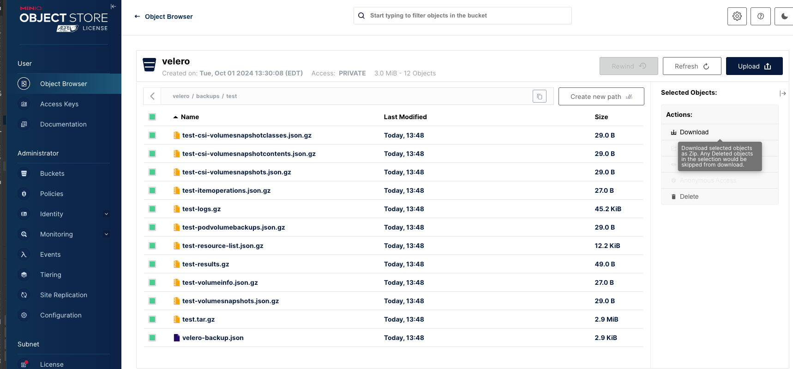

By default, MKE 4 stores backups and restores using the in-cluster storage
provider, the [MinIO add-on](https://min.io/).


  MinIO is not currently backed by persistent storage. For persistent storage of backups, use an external storage provider or download the MinIO backups.



   The offered instructions assume that you have created a cluster and
   applied a blueprint with the default MKE backup configuration.


## Create an in-cluster backup

To create an in-cluster backup, run:

```shell
mkectl backup create --name <name>
```

Example output:

```shell
mkectl backup create --name test
INFO[0000] Creating backup test...
Backup request "test" submitted successfully.
Run `velero backup describe test` or `velero backup logs test` for more details.
INFO[0000] Waiting for backup test to complete...
INFO[0003] Waiting for backup to complete. Current phase: InProgress
INFO[0006] Waiting for backup to complete. Current phase: InProgress
INFO[0009] Waiting for backup to complete. Current phase: InProgress
INFO[0012] Waiting for backup to complete. Current phase: InProgress
INFO[0015] Waiting for backup to complete. Current phase: Completed
```

The backup should be present in the MinIO bucket. 

To list the backups, run:

```shell
mkectl backup list
```

Example output:

```shell
mkectl backup list
NAME   STATUS      ERRORS   WARNINGS   CREATED                         EXPIRES   STORAGE LOCATION   SELECTOR
test   Completed   0        0          2024-05-07 17:29:18 -0400 EDT   29d       default            <none>
```

To view detailed logs of a backup, log in to the MinIO UI. 

## Restore from an in-cluster backup

A restore operation returns the Kubernetes cluster to the state it was in at the time the backup you selected was created.

To perform a restore using an in-cluster backup, run:

```shell
mkectl restore create --name test
```

Example output:

```shell
mkectl restore create --name test
INFO[0000] Waiting for restore test-20240507173309 to complete...
INFO[0000] Waiting for restore to complete. Current phase: InProgress
INFO[0003] Waiting for restore to complete. Current phase: InProgress
INFO[0006] Waiting for restore to complete. Current phase: InProgress
INFO[0009] Waiting for restore to complete. Current phase: InProgress
INFO[0012] Waiting for restore to complete. Current phase: InProgress
INFO[0015] Waiting for restore to complete. Current phase: InProgress
INFO[0018] Waiting for restore to complete. Current phase: InProgress
INFO[0021] Waiting for restore to complete. Current phase: InProgress
INFO[0024] Waiting for restore to complete. Current phase: InProgress
INFO[0027] Waiting for restore to complete. Current phase: Completed
INFO[0027] Restore test-20240507173309 completed successfully
```

To list the restores, run:

```shell
mkectl restore list
```

Example output:

```shell
mkectl restore list
NAME                  BACKUP   STATUS      STARTED                         COMPLETED                       ERRORS   WARNINGS   CREATED                         SELECTOR
test-20240507173309   test     Completed   2024-05-07 17:33:09 -0400 EDT   2024-05-07 17:33:34 -0400 EDT   0        121        2024-05-07 17:33:09 -0400 EDT   <none>
```

To view detailed logs, log in to the MinIO UI.

## Access the MinIO Console

To access the MinIO Console:

1. Obtain the username from your cluster:

   ```shell
   kubectl --kubeconfig <path_to_kubeconfig> get secret -n mke minio-credentials -o jsonpath='{.data.root-user}' | base64 -d
   ```

2. Obtain the password from your cluster:

   ```shell
   kubectl --kubeconfig <path_to_kubeconfig> get secret -n mke minio-credentials -o jsonpath='{.data.root-password}' | base64 -d
   ```

3. Navigate to the external address for your ingress controller under `/minio/`.

   Example:
   `https://<external_address>/minio/`

4. Log in using the username and password. The Velero bucket displays under the Object browser, and you can download or upload backups, using the options provided by the MinIO UI.

   
