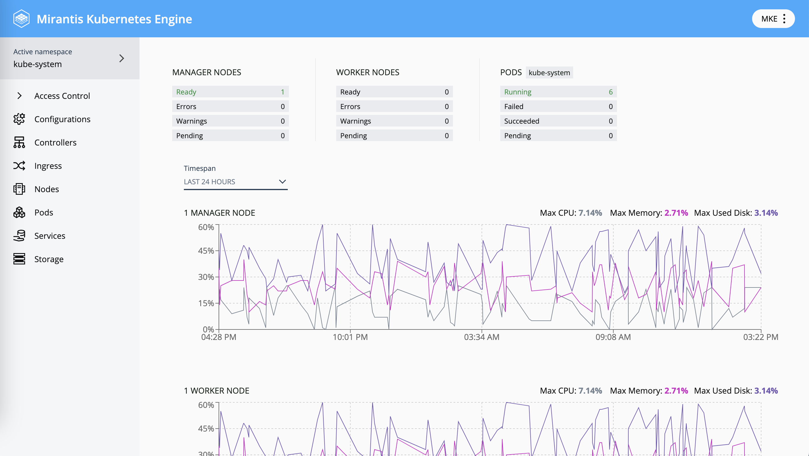

The MKE Dashboard add-on provides a web UI that you can use to manage
Kubernetes resources:

To access the MKE Dashboard, which is enabled by default, navigate to the
address of the load balancer endpoint from a freshly installed cluster. Refer
to [Load balancer requirements](../../getting-started/system-requirements#load-balancer-requirements) for detailed information.

