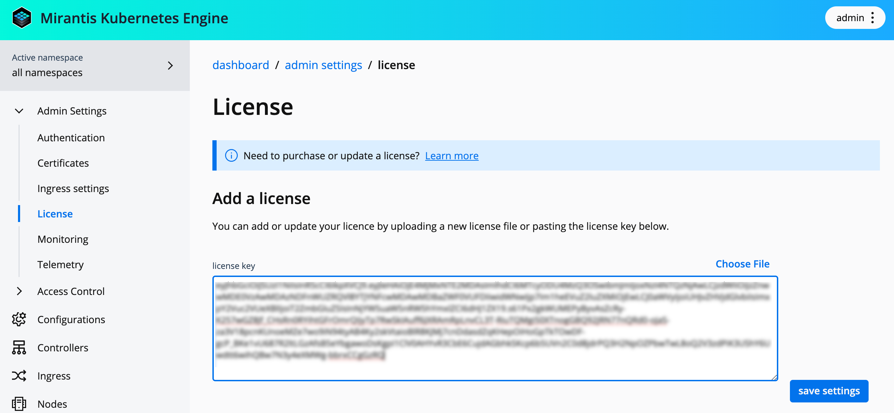



You must have a valid license to lawfully run MKE4. For more
information, refer to [Mirantis Agreements and Terms](https://legal.mirantis.com/).



## Obtain your MKE4 license

[Install the MKE CLI](../install-mke-cli) prior to downloading your MKE4 license.

1. Locate the Welcome to Mirantis' CloudCare Portal email sent to you from Mirantis
   Support. If you do not have the email, confirm with your Designated Administrator
   that you have been added as a Designated Contact.

2. Click **Environments** in the top navigation bar of the MKE web UI.

3. Click the **Cloud Name** that is associated with the license you want to download.

4. Scroll down to **License Information** and click the **License File URL**. 
   A new tab opens in your browser.

5. Click **View file** to download your license file.



Though MKE4 is generally a subscription-only service, you can obtain a free trial license from Mirantis. Make your request using the [Mirantis contact form](https://www.mirantis.com/contact).



## Add the license

1. Log in to the MKE web UI with an administrator account.
2. In the left-side navigation panel, navigate to **Admin Settings** -> **License**.
3. Insert the license into the **license key** field. To do this, click
   **Choose File** and navigate to the ``.lic`` file you previously downloaded.
   Alternately, you can copy-paste the contents of the ``.lic`` file into the
   field as a text string.

   

4. Click **Save settings** to update the MKE4 license.

## Set the license in the configuration

1. Insert the license into ``spec.license.token`` in the MKE4
   configuration file:

    ```yaml
    spec:
      license:
        token: <your-license-file>
    ```

2. Apply the license:

   ```commandline
   mkectl apply
   ```

3. Check the license status:

   ```commandline
   kubectl -n mke get mkeconfig mke -ojsonpath="{.status.licenseStatus}" | jq 
   ```

   Example output:
   
   ```json
   {
     "expiration": "2027-10-10T07:00:00Z",
     "licenseType": "Offline",
     "maxEngines": 10,
     "scanningEnabled": true,
     "subject": "example",
     "tier": "Production"
   }
   ```


